# Gboy Companion

Gboy is a native macOS desktop companion. He lives on your screen, reacts to the cursor, runs a large animation loop, and now ships from a cleaner repo layout that is easier to publish on GitHub and easier to build on any recent Mac.

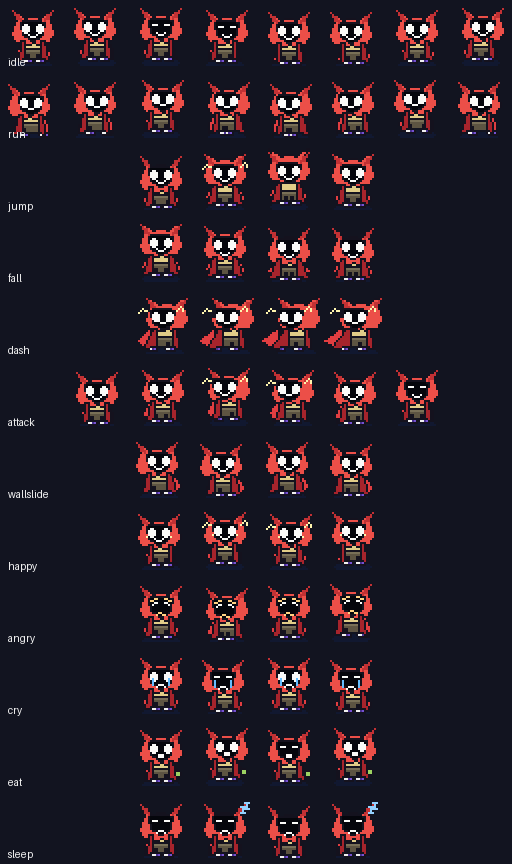

## Links

- [Neuki.wiki](https://neuko.wiki) for lore, transmissions, and worldbuilding
- [Gboy.special](https://gboyspecial.com) for the dedicated Gboy image experience
- [NeukoAi](https://neuko.ai) for the wider Neuko AI portal

## Animation Preview

These are real loops pulled from the same runtime-resolved sprite sheets the bundled app prefers when it launches.

<table>
  <tr>
    <td align="center">
      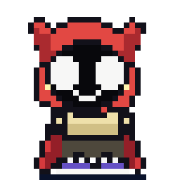<br>
      <strong>Happy</strong>
    </td>
    <td align="center">
      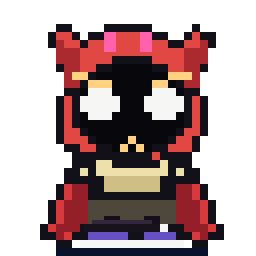<br>
      <strong>Angry</strong>
    </td>
    <td align="center">
      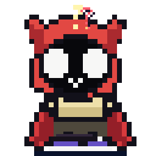<br>
      <strong>Confused</strong>
    </td>
    <td align="center">
      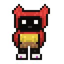<br>
      <strong>Bored</strong>
    </td>
    <td align="center">
      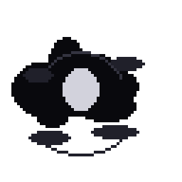<br>
      <strong>Smoke Drift</strong>
    </td>
    <td align="center">
      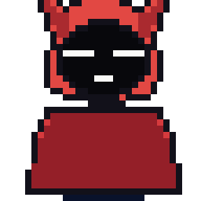<br>
      <strong>Blanket Nest</strong>
    </td>
  </tr>
</table>

## Sprite Sheet Samples

These are the exact sheet-style assets used to drive the companion animations.

<table>
  <tr>
    <td align="center">
      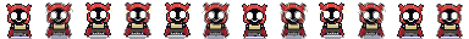<br>
      <code>happy_mastered_sheet.png</code>
    </td>
    <td align="center">
      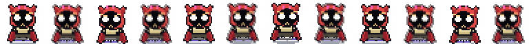<br>
      <code>angry_mastered_sheet.png</code>
    </td>
    <td align="center">
      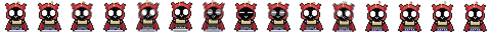<br>
      <code>confused_mastered_sheet.png</code>
    </td>
  </tr>
  <tr>
    <td align="center">
      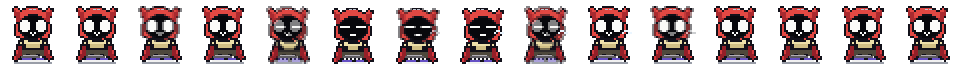<br>
      <code>bored_mastered_sheet.png</code>
    </td>
    <td align="center">
      <br>
      <code>smoke_drift_mastered_sheet.png</code>
    </td>
    <td align="center">
      <br>
      <code>blanket_nest_extended_sheet.png</code>
    </td>
  </tr>
</table>

## Download

**[Download the latest release →](../../releases/latest)**

Download `Gboy.Companion.zip`, unzip it, then drag `Gboy Companion Native.app` into `/Applications`.

## First Launch

Because the app is not notarized yet, macOS may block the first launch.

1. Right-click `Gboy Companion Native.app`
2. Click `Open`
3. Click `Open` again in the warning dialog

Or run:

```bash
xattr -cr "/Applications/Gboy Companion Native.app"
```

The app runs from the menu bar with no Dock icon.

## What It Does

- Walks, runs, skates, climbs, sleeps, hides, and patrols around the screen
- Tracks the cursor and reacts with visible mood and power animations
- Plays a large sprite library of hacker, smoke, glitch, graffiti, food, sports, and idle scenes
- Uses chat, memory, and pluggable AI providers
- Stores editable character, provider, and memory files in Application Support

## Requirements

- macOS 13 or newer
- Apple Silicon or Intel Mac

## Build From Source

```bash
git clone https://github.com/YOUR_USERNAME/Gboy.git
cd Gboy/apps/macos-companion
python3 -m pip install pillow
chmod +x build_app.sh
./build_app.sh
./install_desktop_launcher.sh
open "build/Gboy Companion Native.app"
```

You also need Xcode Command Line Tools:

```bash
xcode-select --install
```

Smoke test:

```bash
"build/Gboy Companion Native.app/Contents/MacOS/gboy-companion-native" --smoke-test
```

The build also generates a sprite-derived app icon preview at `build/Gboy.Companion.Icon.png`.

## AI Setup

The companion supports:

- local `ollama`
- OpenAI
- Claude
- generic OpenAI-compatible APIs

The easiest local setup is:

```bash
ollama pull qwen2.5:3b-instruct
```

Editable AI files are created on first launch in:

- `~/Library/Application Support/Gboy Companion Native/AI/character.json`
- `~/Library/Application Support/Gboy Companion Native/AI/provider.json`
- `~/Library/Application Support/Gboy Companion Native/AI/memory.json`

## Repo Layout

The current build uses art from `apps/`.

```text
Gboy/
├── apps/
│   ├── macos-companion/    # AppKit desktop companion app
│   └── godot-game/         # Godot source project and primary sprite sheets
├── .github/
│   ├── readme/             # Landing-page preview GIFs
│   └── workflows/          # Release automation
```

## Working On It

Important paths:

- `apps/macos-companion/Sources/CompanionController.swift`
- `apps/macos-companion/Sources/CompanionAI.swift`
- `apps/macos-companion/Sources/ChatWindow.swift`
- `apps/godot-game/assets/sprites/player/`
- `apps/macos-companion/Assets/Sprites/`

To add a new animation:

1. Add the sprite sheet to `apps/godot-game/assets/sprites/player/`
2. Register it in `apps/macos-companion/Sources/CompanionController.swift`
3. Rebuild with `apps/macos-companion/build_app.sh`
